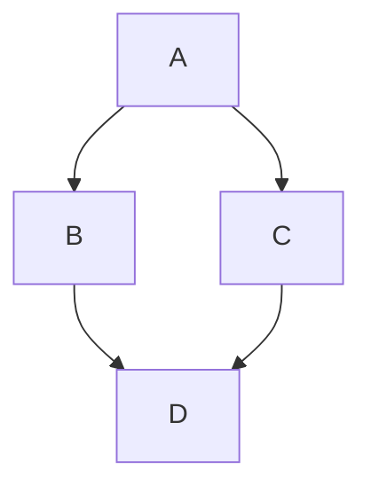

# Título del Artículo

Escribe aquí el contenido extenso en **Markdown**.

> [!NOTE]
> Puedes incluir notas destacadas, tablas y fragmentos de código.

## Sección 1
Contenido redactado de forma limpia sin tocar HTML.

~~This was mistaken text~~
_This text is italicized_
***All this text is important***
This is a <sub>subscript</sub> text
This is a <sup>superscript</sup> text
This is an <ins>underlined</ins> text
>  Text that is a quote

Use `git status` to list all new or modified files that haven't yet been committed.

Some basic Git commands are:
```
git status
git add
git commit
```
The background color is `#ffffff` for light mode and `#000000` for dark mode.
This site was built using [GitHub Pages](https://pages.github.com/).
Link to the sample section: [pruebas](#pruebas).
[Contribution guidelines for this project](content/fisica-relativa.md) 
/
This example\
Will span two lines
- [x] #739
- [ ] https://github.com/octo-org/octo-repo/issues/740
- [ ] Add delight to the experience when all tasks are complete :tada:

Here is a simple footnote[^1].

A footnote can also have multiple lines[^2].

I need to highlight these ==very important words==.

````md
```dataviewjs
dv.paragraph(`
~~~mermaid
graph TD
    A --> B
~~~
`)
```
````

```dataviewjs
dv.paragraph(`
~~~mermaid
graph TD
    A --> B
~~~
`)
```

comment

This is an %%inline%% comment.

%%
This is a block comment.

Block comments can span multiple lines.
%%

katex

$x + y = z$

mermaid graph

### pruebas
<!-- This content will not appear in the rendered Markdown -->
<details>
<summary>Title or Callout</summary>

Your text. All normal markdown formatting
still works here. Lists, headers, images,
code blocks and so on...

</details>

este es un ejemplo, pulsa `Enter` para valer madres

> [!NOTE] **Sabias que:**
> **contenido** del *callout*

> [!TIP] Título Personalizado
> Contenido del **TIP** que puede incluir _varios formatos_.

> [!WARNING]
> Contenido del **WARNING** que puede incluir _varios formatos_.
H

> [!IMPORTANT]
> Contenido del **IMPORTANT** que puede incluir _varios formatos_.

> [!CAUTION]
> Contenido del **CAUTION** que puede incluir _varios formatos_.

**codigo python edad**
```python
edad = 18

if edad == 18:
    print("Acabas de cumplir la mayoría de edad.")
else:
    print("Tienes una edad diferente a 18.")
```

**codigo python listas**
```python
lista_a = [1, 2, 3]
lista_b = [1, 2, 3]
lista_c = [3, 2, 1]

# Mismo orden y mismos elementos
print(lista_a == lista_b)  # Devuelve True

# Mismos elementos pero diferente orden
print(lista_a == lista_c)  # Devuelve False
```

[^1]: My reference.
[^2]: To add line breaks within a footnote, add 2 spaces to the end of a line.  


a